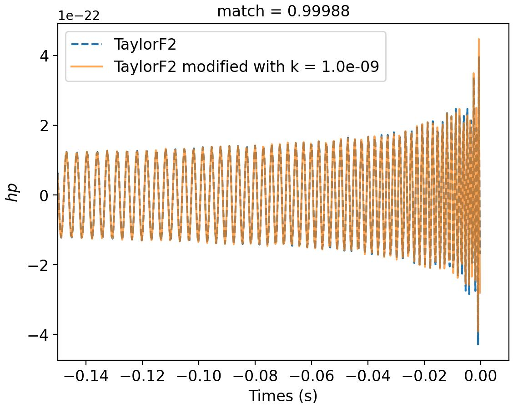

# test_of_special_relativity

To generate a modified TaylorF2 waveform (phasing given by eq. 4 in the paper), requires the following packages: numpy, scipy, pycbc.
These dependencies should all be installable with conda or pip. First we need to install pycbc python package and then install the extra waveform plugin to make the modified TaylorF2 in pycbc's available waveforms.

Install pycbc pacakge

    $ pip install pycbc

Clone this repository and install modified TaylorF2 waveform plugin

    $ git clone https://github.com/lalit-pathak/test_of_special_relativity.git
    $ cd test_waveform_plugin
    $ python3 setup.py install

For running this analysis, the GW170817 strain data can be downloaded from the following links: [inline link](https://www.jetbrains.com)
Example to generate modified waveform 

```python
import numpy as np
import matplotlib.pyplot as plt
from tqdm import tqdm
import pycbc
from pycbc.frame import read_frame
from pycbc.catalog import Merger
from pycbc import waveform
from pycbc.pnutils import f_SchwarzISCO
from pycbc.types import TimeSeries
from pycbc.psd import aLIGOZeroDetHighPower
from pycbc.psd import interpolate, welch, inverse_spectrum_truncation
from pycbc.filter import highpass, matched_filter

fLow, segLen = 20, 360
fSamp = 4096
m1, m2 = 1.41, 1.35
s1z, s2z = 0.0004, 0.0004
distance = 45
inclination = 2.5
f_final = f_SchwarzISCO(m1+m2)

merger = Merger("GW170817")
strain, stilde = {}, {}
ifos = ['L1', 'H1', 'V1']
fLow = 20 
fHigh = f_SchwarzISCO(m1+m2)

low_frequency_cutoff = {}
high_frequency_cutoff = {}

for ifo in ifos:
    
    low_frequency_cutoff[ifo] = fLow
    high_frequency_cutoff[ifo] = fHigh
    
#-- reading the data ---
for ifo in ifos:
    
    ts = read_frame("{}-{}_LOSC_CLN_4_V1-1187007040-2048.gwf".format(ifo[0], ifo),
                    '{}:LOSC-STRAIN'.format(ifo),
                   start_time=merger.time - 342,   
                   end_time=merger.time + 30,     
                   check_integrity=False)
    
    # Read the detector data and remove low frequency content
    strain[ifo] = highpass(ts, 18, filter_order=4)
    
    # Remove time corrupted by the high pass filter
    strain[ifo] = strain[ifo].crop(6,6)

    # Also create a frequency domain version of the data
    stilde[ifo] = strain[ifo].to_frequencyseries()


#-- calculating psds ---

psds = {}

for ifo in ifos:
    # Calculate a psd from the data. We'll use 2s segments in a median - welch style estimate
    # We then interpolate the PSD to the desired frequency step. 
    psds[ifo] = interpolate(strain[ifo].psd(2), stilde[ifo].delta_f)

    # We explicitly control how much data will be corrupted by overwhitening the data later on
    # In this case we choose 2 seconds.
    psds[ifo] = inverse_spectrum_truncation(psds[ifo], int(2 * strain[ifo].sample_rate),
                                    low_frequency_cutoff=low_frequency_cutoff[ifo], trunc_method='hann')
                                    
params = {'mass1': m1, 'mass2': m2, 'spin1z': s1z, 'spin2z': s2z, 'distance': distance, \
                      'f_lower': fLow, 'f_final': f_final, 'segLen': segLen, 'inclination': inclination}

# generate a TaylorF2 model waveform
hp, hc = waveform.get_fd_waveform(approximant='TaylorF2',
                               delta_f=1/params['segLen'], **params)
                               
k = 1e-9

hp_td, hc_td = hp.to_timeseries(), hc.to_timeseries()
hp_td_mod, hc_td_mod = hp_mod.to_timeseries(), hc_mod.to_timeseries()

# match calculation
match_value = pycbc.filter.matchedfilter.match(hp_mod, hp, psd=psds[ifos[0]])[0] # calculated using psd from 'L1'

plt.figure(figsize=(8,5))

fontsize = 12

plt.plot(hp_td.sample_times, hp_td, ls='--', label='TaylorF2')
plt.plot(hp_td_mod.sample_times, hp_td_mod, alpha=0.7, label='TaylorF2 modified with k = %.1e'%k)
plt.xlim(-0.15, 0.01)
plt.tick_params(which='both', labelsize=fontsize)
plt.xlabel('Times (s)', fontsize=fontsize)
plt.ylabel(r'$hp$', fontsize=fontsize)
plt.title('match = %.5f'%match_value, fontsize=fontsize)
plt.legend(fontsize=fontsize)
plt.show()



```
